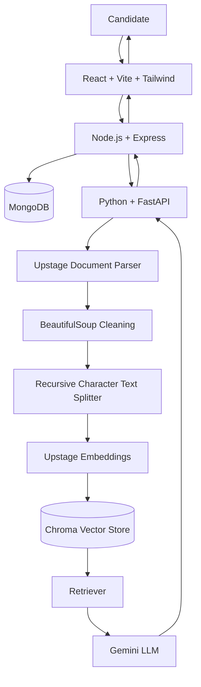
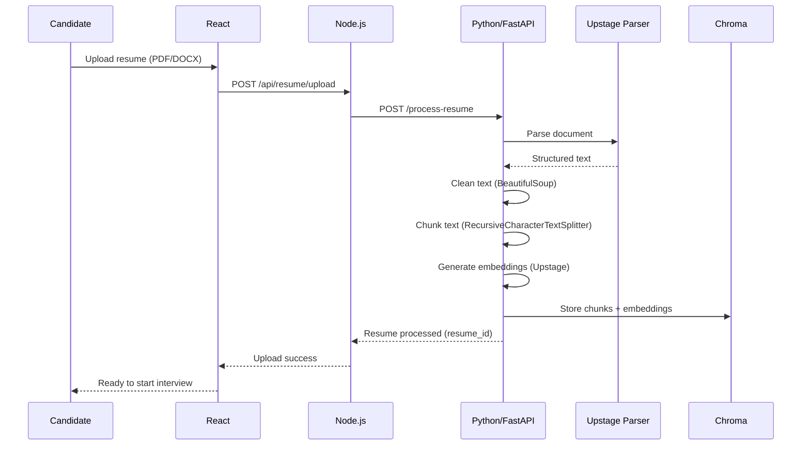
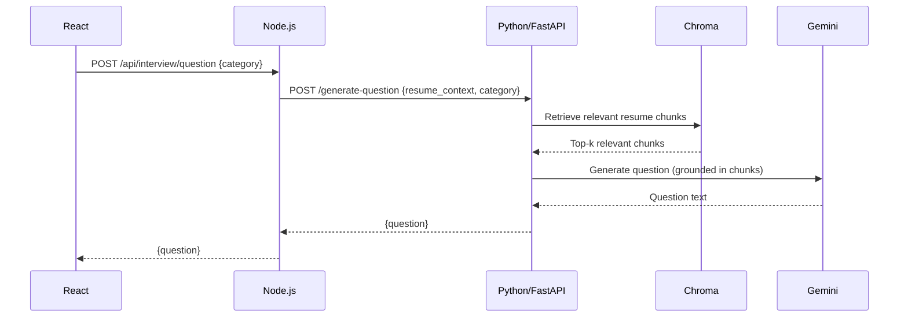
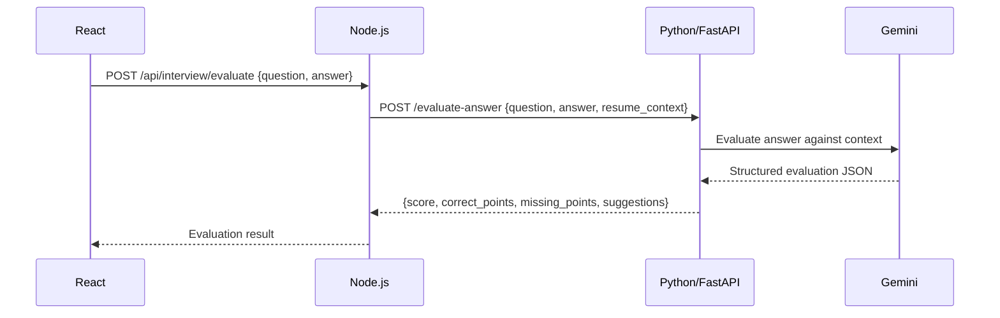
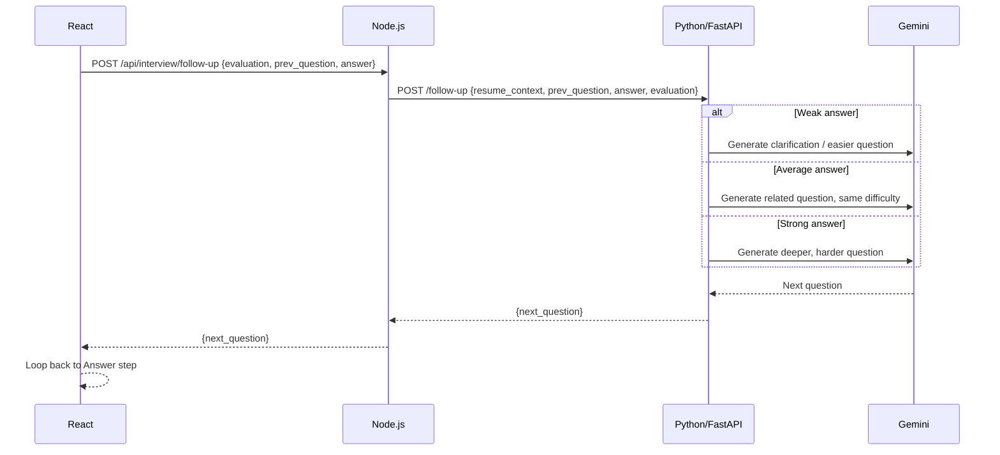
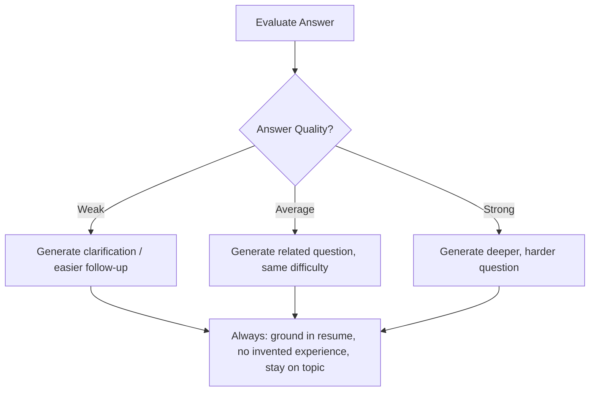

# 🧠 MINDFLARE

### AI Interviewer That Understands You


MINDFLARE is an AI-powered personalized mock interview platform. A candidate uploads their resume, and instead of getting generic, static interview questions, they get a **live, adaptive interview** — one that reads their actual skills, projects, and experience, asks questions grounded in that context, evaluates each answer in real time, and decides whether to go deeper or pull back based on how well they're doing. It's the difference between practicing with a question bank and practicing with someone who actually read your resume.

---

## 📑 Table of Contents

1. [Project Overview](#-project-overview)
2. [Problem Statement](#-problem-statement)
3. [Our Solution](#-our-solution)
4. [Key Features](#-key-features)
5. [Why MINDFLARE Is Different](#-why-mindflare-is-different)
6. [Complete Architecture](#-complete-architecture)
7. [System Flow](#-system-flow)
8. [Resume Processing Flow](#-resume-processing-flow)
9. [Question Generation Flow](#-question-generation-flow)
10. [Answer Evaluation Flow](#-answer-evaluation-flow)
11. [Adaptive Interview Flow](#-adaptive-interview-flow)
12. [Frontend Architecture](#-frontend-architecture)
13. [Node.js Backend Architecture](#-nodejs-backend-architecture)
14. [Python AI Architecture](#-python-ai-architecture)
15. [MongoDB vs Chroma](#-mongodb-vs-chroma)
16. [Technology Stack](#-technology-stack)
17. [Folder Structure](#-folder-structure)
18. [API Architecture](#-api-architecture)
19. [API Endpoint Table](#-api-endpoint-table)
20. [Environment Variables](#-environment-variables)
21. [Installation](#-installation)
22. [Running the Project](#-running-the-project)
23. [Example API Requests & Responses](#-example-api-requests--responses)
24. [RAG Pipeline Explained](#-rag-pipeline-explained)
25. [Adaptive Interview Algorithm](#-adaptive-interview-algorithm)
26. [Database Schema](#-database-schema)
27. [Error Handling](#-error-handling)
28. [Security Considerations](#-security-considerations)
29. [Testing Strategy](#-testing-strategy)
30. [72-Hour Development Plan](#-72-hour-development-plan)
31. [Team Task Distribution](#-team-task-distribution)
32. [MVP Scope (P0 / P1 / P2)](#-mvp-scope)
33. [Future Enhancements](#-future-enhancements)
34. [Hackathon Demo Flow](#-hackathon-demo-flow)
35. [Judge Q&A Prep](#-judge-qa-prep)
36. [Troubleshooting](#-troubleshooting)
37. [Contribution](#-contribution)
38. [License](#-license)

---

## 🎯 Project Overview

MINDFLARE analyzes a candidate's resume and generates a personalized mock interview. Each question is grounded in the candidate's actual skills, technologies, and projects rather than pulled from a generic question bank. As the candidate answers, the system evaluates the response and adapts the next question's difficulty and direction accordingly.

**Core loop:**

```
Resume → Relevant Context → Personalized Question → Candidate Answer → Evaluation → Adaptive Follow-up
```

## 🧩 Problem Statement

Most interview prep tools fall into one of two buckets:

- **Static question banks** — same generic questions for everyone, regardless of the candidate's actual background.
- **Generic AI chatbots** — conversational, but not grounded in the candidate's resume, so questions feel random and follow-ups don't build on prior answers meaningfully.

Neither adapts in real time to how well the candidate is actually performing.

## ✅ Our Solution

MINDFLARE combines **RAG (Retrieval-Augmented Generation)** with an **adaptive interview engine**:

- Resume content is parsed, chunked, embedded, and stored in a vector database.
- Questions are generated by retrieving the most relevant resume context, not by guessing.
- Every answer is scored and analyzed for correctness, gaps, and depth.
- The next question is chosen dynamically — easier, related, or harder — based on that evaluation.

## ⭐ Key Features

| Feature                                                | Status                        |
| ------------------------------------------------------ | ----------------------------- |
| Resume upload & parsing                                | ✅ Currently Implemented (P0) |
| Resume-grounded question generation (RAG)              | ✅ Currently Implemented (P0) |
| Real-time answer evaluation (score, gaps, suggestions) | ✅ Currently Implemented (P0) |
| Adaptive follow-up question logic                      | ✅ Currently Implemented (P0) |
| Interview history & session storage                    | 🔜 Planned (P1)               |
| Final interview report                                 | 🔜 Planned (P1)               |
| Authentication                                         | 🔜 Planned (P1)               |
| Analytics dashboard                                    | 🔜 Planned (P1)               |
| Voice interview / speech-to-text                       | 🔮 Future Enhancement (P2)    |
| Job description matching                               | 🔮 Future Enhancement (P2)    |
| Live coding interview mode                             | 🔮 Future Enhancement (P2)    |
| Multi-language interviews                              | 🔮 Future Enhancement (P2)    |

> **Note:** This table reflects the intended MVP scope for a 72-hour build. Update the checkmarks to match your actual repository state before submission — do not claim a feature is implemented until it's working end-to-end.

## 🚀 Why MINDFLARE Is Different

- **Grounded, not generic** — every question traces back to a real line in the candidate's resume via RAG retrieval, not free-form LLM guessing.
- **Genuinely adaptive** — difficulty and direction shift based on a structured evaluation of the previous answer, not a fixed question sequence.
- **Separation of concerns** — Node.js owns application logic (auth, sessions, storage); Python owns AI/RAG logic. Each service can be scaled, tested, and reasoned about independently.
- **Anti-hallucination by design** — the system is explicitly instructed to never invent experience the candidate doesn't have, and to keep questions tied to retrieved resume context.

---

## 🏗 Complete Architecture



## 🔄 System Flow

At a high level, every request flows: **React → Node.js → Python/FastAPI → RAG (Chroma + Gemini) → Python → Node.js → React**, with MongoDB persisting application data along the way (users, sessions, questions, answers, scores).

## 📄 Resume Processing Flow



## ❓ Question Generation Flow



## 📝 Answer Evaluation Flow



## 🔁 Adaptive Interview Flow



---

## 🎨 Frontend Architecture

- **Framework:** React + Vite for fast dev builds.
- **Styling:** Tailwind CSS.
- **Routing:** React Router.
- **HTTP client:** Axios, wrapped in a `services/` layer so components never call `fetch`/`axios` directly.
- **State:** Local component state / context for interview session state (current question, answer draft, evaluation, history).
- **Structure:**
  - `components/` — reusable UI pieces (QuestionCard, AnswerBox, ScoreBadge, etc.)
  - `pages/` — route-level screens (Upload, Interview, Results)
  - `services/` — API wrapper functions (`resumeService.js`, `interviewService.js`)

## ⚙️ Node.js Backend Architecture

Node.js is the **application backend** — it never talks to Gemini, Chroma, or Upstage directly. It owns:

- REST API surface consumed by the frontend
- User/session management
- Resume file upload handling (Multer) and forwarding to Python
- Persisting sessions, questions, answers, scores to MongoDB
- Calling the Python AI service and relaying results back to React
- Authentication (planned — see [MVP Scope](#-mvp-scope))

## 🧠 Python AI Architecture

Python is the **isolated AI/RAG service**, exposed via FastAPI. It owns:

- Resume parsing (Upstage Document Parser)
- HTML/text cleaning (BeautifulSoup)
- Chunking (`RecursiveCharacterTextSplitter`)
- Embedding generation (Upstage Embeddings)
- Vector storage & similarity retrieval (Chroma)
- Resume-grounded question generation (Gemini)
- Answer evaluation (Gemini)
- Adaptive follow-up generation (Gemini)

Node.js and Python communicate over plain REST/JSON — no separate message broker or microservice mesh, to keep the 72-hour build achievable.

## 🗄 MongoDB vs Chroma

|              | MongoDB                                                                                   | Chroma                                         |
| ------------ | ----------------------------------------------------------------------------------------- | ---------------------------------------------- |
| **Stores**   | Users, resume metadata, interview sessions, questions, answers, scores, feedback, history | Resume text chunks, embeddings, chunk metadata |
| **Used for** | Application data / CRUD                                                                   | Semantic similarity search (retrieval)         |
| **Owned by** | Node.js                                                                                   | Python                                         |
| **Analogy**  | The system of record                                                                      | The "memory" the AI searches through           |

To avoid duplication, resume **raw text and embeddings** live only in Chroma; MongoDB stores a reference (`resume_id`) plus lightweight metadata (filename, upload date, candidate id) — not the full parsed content.

---

## 🛠 Technology Stack

**Frontend**

- React, Vite, Tailwind CSS, Axios, React Router
- Recharts (if analytics/score charts are needed)

**Node.js Backend**

- Node.js, Express.js, MongoDB, Mongoose
- Multer (file uploads), Axios (calls to Python)
- JWT / bcrypt (if authentication is implemented)

**Python AI Service**

- Python, FastAPI
- LangChain, `langchain-upstage`, `langchain-chroma`, `langchain-google-genai`
- Upstage Document Parse, Upstage Embeddings
- ChromaDB
- Gemini
- BeautifulSoup4
- `RecursiveCharacterTextSplitter`

---

## 📁 Folder Structure

```
MINDFLARE/
│
├── frontend/
│   ├── src/
│   │   ├── components/
│   │   ├── pages/
│   │   ├── services/
│   │   ├── App.jsx
│   │   └── main.jsx
│   ├── package.json
│   └── vite.config.js
│
├── backend/
│   └── node-server/
│       ├── src/
│       │   ├── controllers/
│       │   │   ├── resumeController.js
│       │   │   └── interviewController.js
│       │   │
│       │   ├── routes/
│       │   │   ├── resumeRoutes.js
│       │   │   └── interviewRoutes.js
│       │   │
│       │   ├── models/
│       │   │   ├── User.js
│       │   │   └── Interview.js
│       │   │
│       │   ├── services/
│       │   │   └── pythonService.js
│       │   │
│       │   ├── middleware/
│       │   │   └── upload.js
│       │   │
│       │   └── server.js
│       │
│       └── package.json
│
├── ai-engine/
│   ├── main.py
│   ├── requirements.txt
│   ├── services/
│   │   ├── parser.py
│   │   ├── rag.py
│   │   ├── interviewer.py
│   │   └── evaluator.py
│   └── chroma_db/
│
├── uploads/
├── .env.example
├── .gitignore
└── README.md
```

---

## 🔌 API Architecture

Two API layers:

1. **Public REST API** (`Node.js`) — consumed by the React frontend.
2. **Internal API** (`Python/FastAPI`) — consumed only by Node.js, never exposed to the browser.

## 📋 API Endpoint Table

### Public API (Node.js → React)

| Method | Endpoint                   | Purpose                                        |
| ------ | -------------------------- | ---------------------------------------------- |
| POST   | `/api/resume/upload`       | Upload and process a candidate's resume        |
| POST   | `/api/interview/question`  | Get the next interview question for a category |
| POST   | `/api/interview/evaluate`  | Evaluate a submitted answer                    |
| POST   | `/api/interview/follow-up` | Get an adaptive follow-up question             |
| GET    | `/api/interview/:id`       | Fetch a specific interview session             |
| GET    | `/api/interviews`          | List all interview sessions for a user         |
| GET    | `/api/health`              | Health check                                   |

### Internal API (Python → Node.js only)

| Method | Endpoint             | Purpose                                         |
| ------ | -------------------- | ----------------------------------------------- |
| POST   | `/process-resume`    | Parse, clean, chunk, embed, and store a resume  |
| POST   | `/generate-question` | Retrieve context + generate a grounded question |
| POST   | `/evaluate-answer`   | Score and analyze a candidate answer            |
| POST   | `/follow-up`         | Generate the next adaptive question             |
| GET    | `/health`            | Health check                                    |

**Documentation convention for each endpoint:** Purpose · Method · URL · Request body · Response · Error response — see examples below.

---

## 🔐 Environment Variables

`.env.example`:

```env
NODE_PORT=5000
PYTHON_AI_URL=http://localhost:8000
MONGODB_URI=
UPSTAGE_API_KEY=
GOOGLE_API_KEY=
```

> ⚠️ **Never commit `.env` to version control.** Only `.env.example` (with empty values) should be tracked in git. Add `.env` to `.gitignore`.

---

## 💻 Installation

**Frontend**

```bash
npm create vite@latest frontend
cd frontend
npm install
```

**Node.js Backend**

```bash
mkdir backend
cd backend
npm init -y
npm install express mongoose cors dotenv axios multer bcryptjs jsonwebtoken
npm install --save-dev nodemon
```

**Python AI Service**

```bash
python -m venv .venv
```

Activate (Windows):

```bash
.venv\Scripts\activate
```

Install dependencies:

```bash
pip install fastapi uvicorn
pip install langchain
pip install langchain-text-splitters
pip install langchain-upstage
pip install langchain-chroma
pip install langchain-google-genai
pip install chromadb
pip install beautifulsoup4
pip install python-dotenv
```

---

## ▶️ Running the Project

Development requires **three terminals** running simultaneously.

**Terminal 1 — Frontend**

```bash
cd frontend
npm run dev
```

**Terminal 2 — Node.js backend**

```bash
cd backend/node-server
npm run dev
```

**Terminal 3 — Python AI service**

```bash
cd ai-engine
.venv\Scripts\activate
uvicorn main:app --reload --port 8000
```

**Ports**

| Service        | Port   |
| -------------- | ------ |
| React (Vite)   | `5173` |
| Node.js        | `5000` |
| Python FastAPI | `8000` |

---

## 📨 Example API Requests & Responses

**Resume Upload**

Request: `POST /api/resume/upload` (multipart/form-data, field `resume`)

Response:

```json
{
  "success": true,
  "resume_id": "res_8f3a1c",
  "message": "Resume processed and indexed"
}
```

**Generate Question**

React → Node:

```json
{ "category": "technical" }
```

Node → Python:

```json
{
  "resume_context": "res_8f3a1c",
  "category": "technical"
}
```

Python response:

```json
{
  "question": "Your resume mentions a Socket.IO-based real-time bidding system in AgroVista — walk me through how you handled race conditions between simultaneous bids."
}
```

**Evaluate Answer**

Request: `POST /api/interview/evaluate`

```json
{
  "question": "Explain how you handled race conditions...",
  "answer": "I used MongoDB transactions and..."
}
```

Response:

```json
{
  "score": 7,
  "technical_accuracy": "Mostly correct, minor gap on isolation levels",
  "correct_points": [
    "Identified need for atomic updates",
    "Mentioned transactions"
  ],
  "missing_points": ["Did not mention optimistic vs pessimistic locking"],
  "improvement_suggestions": "Mention which isolation level you chose and why."
}
```

**Error response (all endpoints)**

```json
{
  "success": false,
  "error": "RESUME_NOT_FOUND",
  "message": "No resume found for the given resume_id"
}
```

---

## 🔎 RAG Pipeline Explained

In plain language:

1. **Resume upload** — candidate submits a PDF/DOCX.
2. **Document parsing** — Upstage extracts structured text from the file.
3. **Cleaning** — BeautifulSoup strips leftover HTML/formatting noise.
4. **Text splitting** — the cleaned text is broken into overlapping chunks so each piece is small enough for accurate retrieval.
5. **Embedding generation** — each chunk is converted into a vector (Upstage Embeddings) that captures its meaning.
6. **Vector storage** — chunks + vectors go into Chroma.
7. **Similarity retrieval** — when a question is needed, the system embeds the query intent and pulls the most semantically relevant resume chunks.
8. **Context construction** — retrieved chunks are assembled into a prompt context.
9. **Generation** — Gemini generates a question (or evaluation) using that context.

**Why RAG?** Without it, the LLM would ask generic questions from general knowledge, disconnected from what the candidate actually did. RAG grounds every question and evaluation in the candidate's real resume content, which is what makes the interview feel personalized instead of templated.

## 🧮 Adaptive Interview Algorithm

**Input:** resume context, previous question, candidate answer, evaluation



**Rules the algorithm always follows:**

- Ground every question in retrieved resume context.
- Never invent experience the candidate doesn't have.
- Keep follow-ups topically connected to the previous question.

---

## 🗃 Database Schema

**User**

```js
{
  _id: ObjectId,
  name: String,
  email: String,
  passwordHash: String, // if auth implemented
  createdAt: Date
}
```

**Resume**

```js
{
  _id: ObjectId,
  userId: ObjectId, // ref: User
  fileName: String,
  chromaCollectionId: String, // pointer into Chroma, not the content itself
  uploadedAt: Date
}
```

**Interview (session)**

```js
{
  _id: ObjectId,
  userId: ObjectId,   // ref: User
  resumeId: ObjectId, // ref: Resume
  category: String,
  status: String,     // "in_progress" | "completed"
  createdAt: Date
}
```

**Question/Answer**

```js
{
  _id: ObjectId,
  interviewId: ObjectId, // ref: Interview
  question: String,
  answer: String,
  askedAt: Date
}
```

**Evaluation**

```js
{
  _id: ObjectId,
  questionAnswerId: ObjectId, // ref: Question/Answer
  score: Number,
  correctPoints: [String],
  missingPoints: [String],
  improvementSuggestions: String
}
```

**Relationships:** `User 1—N Resume`, `User 1—N Interview`, `Interview 1—N QuestionAnswer`, `QuestionAnswer 1—1 Evaluation`. MongoDB holds all of the above; Chroma independently holds the resume's chunked/embedded content, linked only via `chromaCollectionId`.

---

## 🛡 Error Handling

- All API responses use a consistent shape: `{ success, data | error, message }`.
- Node.js validates request bodies before forwarding to Python (fail fast, avoid wasted LLM calls).
- Python service failures (Gemini/Upstage timeouts, quota errors) are caught and returned as structured errors, not raw stack traces.
- Frontend shows user-friendly fallback messages and allows retry on transient failures (e.g., LLM rate limits).

## 🔒 Security Considerations

- API keys (`UPSTAGE_API_KEY`, `GOOGLE_API_KEY`) live only in backend `.env` files — never sent to or referenced in frontend code.
- `.env` is git-ignored; only `.env.example` is committed.
- File uploads are restricted by type/size (Multer config) before being forwarded to Python.
- CORS is scoped to the known frontend origin only.
- Passwords (once auth is implemented) are hashed with bcrypt; JWT tokens are short-lived.

## 🧪 Testing Strategy

- **Frontend:** manual QA of the upload → question → answer → evaluation → follow-up loop; component-level checks for form validation.
- **Node.js:** endpoint-level testing (Postman/Thunder Client) for each route in the [API table](#-api-endpoint-table); verify MongoDB writes.
- **Python:** isolated testing of each pipeline stage (parse → clean → chunk → embed → retrieve → generate) with a sample resume, independent of Node.
- **Integration:** full end-to-end run through the demo flow before the hackathon deadline.

---

## ⏱ 72-Hour Development Plan

Roles for this plan:

- **Developer 1 — Himanshu Kushwaha:** Python + RAG + Gemini
- **Developer 2 — Nandni Gupta:** React + Node.js + MongoDB

_(Swap these labels if your actual split is reversed — the hour blocks stay the same either way.)_

| Hours | Developer 1 (Python/RAG)                               | Developer 2 (React/Node/Mongo)                            | Deliverable                                         |
| ----- | ------------------------------------------------------ | --------------------------------------------------------- | --------------------------------------------------- |
| 0–4   | Architecture review, repo setup, env config            | Architecture review, repo setup, env config               | Repo scaffolded, `.env.example` in place            |
| 4–10  | Set up FastAPI skeleton, `/health` endpoint            | Build React UI shell (upload page, interview page)        | Basic UI + Python service running                   |
| 10–18 | Resume parser (Upstage), cleaning, chunking            | Node.js backend skeleton, Express routes, MongoDB models  | Node API scaffolded, resume parsing working locally |
| 18–30 | Embeddings + Chroma storage, retriever                 | Node ↔ MongoDB CRUD for users/interviews                  | Resume fully indexed into Chroma                    |
| 30–38 | Node ↔ Python integration for `/process-resume`        | Node ↔ Python integration (Axios service layer)           | End-to-end resume upload flow works                 |
| 38–46 | `/generate-question`, `/evaluate-answer`               | Wire question + evaluate routes into UI                   | Candidate can get a question and submit an answer   |
| 46–54 | Adaptive follow-up algorithm (`/follow-up`)            | Interview loop UI (question → answer → score → next)      | Adaptive loop functional end-to-end                 |
| 54–62 | Bug fixes on generation quality/prompting              | Full frontend integration polish (loading states, errors) | Stable end-to-end demo path                         |
| 62–68 | Support MongoDB history queries from AI side if needed | MongoDB interview history + basic results/report screen   | Interview history visible in UI                     |
| 68–70 | Joint testing of full pipeline                         | Joint testing of full pipeline                            | Bug list triaged and fixed                          |
| 70–72 | Prep judge Q&A answers, architecture talking points    | Deployment, demo rehearsal, slides                        | Demo-ready build + pitch                            |

---

## 👥 Team Task Distribution

| Area                                                   | Owner             |
| ------------------------------------------------------ | ----------------- |
| Resume parsing, chunking, embeddings                   | Himanshu Kushwaha |
| Chroma vector store & retriever                        | Himanshu Kushwaha |
| Gemini prompting (question gen, evaluation, follow-up) | Himanshu Kushwaha |
| React UI (upload, interview, results)                  | Nandni Gupta      |
| Node.js API routes & controllers                       | Nandni Gupta      |
| MongoDB schema & data access                           | Nandni Gupta      |
| Node ↔ Python integration layer                        | Shared            |
| Testing & demo prep                                    | Shared            |

## 🥇 MVP Scope

**P0 — Must Have**

- Resume upload
- Resume parsing
- RAG pipeline (chunk, embed, retrieve)
- Chroma vector store
- Personalized question generation
- Answer evaluation
- Adaptive follow-up
- React interview UI
- Node.js API
- Python API

**P1 — Should Have**

- MongoDB persistence
- Interview history
- Final report
- Authentication
- Analytics

**P2 — Nice to Have**

- Voice interview / speech-to-text
- Job description matching
- Coding interview mode
- Advanced analytics
- Multi-language interviews

> P0 must be fully working before any P1/P2 work begins. If time runs short, cut P1/P2 — never cut P0.

## 🔮 Future Enhancements

- Voice-based interviews with speech-to-text
- Job description matching (tailor questions to a specific JD, not just the resume)
- Live coding interview mode
- Deeper analytics dashboard (trend of scores over sessions, weak-topic heatmap)
- Multi-language interview support

---

## 🎬 Hackathon Demo Flow

A 3–5 minute walkthrough:

1. **Open MINDFLARE** — "This is our AI interviewer that actually reads your resume before asking anything."
2. **Upload resume** — "Watch — it's being parsed, chunked, and embedded into a vector store right now."
3. **Select interview category** — "Let's do a technical round."
4. **Generate personalized question** — "Notice this question references a specific project from the resume, not a generic bank."
5. **Answer the question** — candidate answers live.
6. **Show evaluation** — "Here's the score, what was correct, what was missing."
7. **Show adaptive follow-up** — "Because that answer was strong, it just escalated the difficulty."
8. **Show final score/report** — wrap the session.
9. **Briefly show the architecture diagram** — "Node handles the app, Python handles RAG and the LLM — completely decoupled."

## 🙋 Judge Q&A Prep

**Why RAG?** Grounds questions in the candidate's real resume instead of relying on the LLM's general knowledge, which reduces irrelevant or hallucinated questions.

**Why Chroma?** Fast, lightweight semantic similarity search over resume chunks — purpose-built for exactly this retrieval step.

**Why MongoDB?** Handles structured application data (users, sessions, scores) that doesn't need semantic search — a better fit than a vector store for that kind of data.

**Why Node.js + Python together?** Node is strong for REST APIs and application logic; Python has the mature AI/RAG ecosystem (LangChain, Upstage, Chroma clients). Splitting them keeps each service focused and independently testable.

**What's adaptive about the interview?** The next question's difficulty and direction are chosen based on a structured evaluation of the previous answer — not a fixed script.

**How do you prevent hallucinated questions?** Every generation call is grounded in retrieved resume chunks, and prompts explicitly instruct the model never to invent experience.

**How does the system evaluate answers?** Gemini scores the answer against the retrieved resume context and the question, returning a structured score, correct points, missing points, and suggestions.

**What if the resume lacks relevant info for a category?** The retriever falls back to the closest available context and the system can be prompted to ask a broader, less resume-specific question in that category.

**How would you scale this?** Python and Node are already separate services and can scale independently; Chroma can be swapped for a managed vector DB, and the LLM calls can be queued/rate-limited behind a job system.

**Future improvements?** See [Future Enhancements](#-future-enhancements).

## 🧯 Troubleshooting

| Issue                            | Cause                                   | Solution                                                    |
| -------------------------------- | --------------------------------------- | ----------------------------------------------------------- |
| Missing API keys                 | `.env` not filled in                    | Copy `.env.example` to `.env` and add real keys             |
| Gemini quota / rate limit errors | Too many requests in short time         | Add retry/backoff; check API quota dashboard                |
| Upstage API errors               | Invalid file type or expired key        | Validate file type before upload; check key validity        |
| Chroma metadata errors           | Malformed metadata passed on insert     | Ensure metadata values are simple types (str/int/bool)      |
| Python service unavailable       | FastAPI server not running              | Check Terminal 3, confirm `uvicorn` is running on port 8000 |
| Node cannot connect to Python    | Wrong `PYTHON_AI_URL` in `.env`         | Verify URL/port matches running FastAPI instance            |
| CORS errors                      | Frontend origin not whitelisted in Node | Add `http://localhost:5173` to Node's CORS config           |
| MongoDB connection errors        | Invalid `MONGODB_URI` or DB not running | Check connection string and that MongoDB is accessible      |
| PDF parsing issues               | Corrupted file or unsupported format    | Validate file before upload; test with a known-good PDF     |

## 🤝 Contribution

This is a hackathon project built by a two-person team. For contributions:

1. Fork the repo
2. Create a feature branch (`feature/your-feature`)
3. Commit with clear messages
4. Open a pull request describing the change

## 📄 License

MIT License — see `LICENSE` file for details.

---

## 👥 Team

- **Nandni Gupta**
- **Himanshu Kushwaha**

## 🚀 Built For

**AIH 2026 Hackathon**
